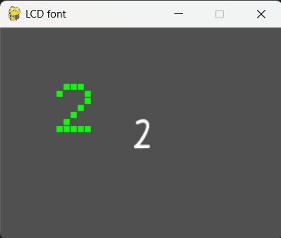

# pygame_samples

 + demo_01.py: pygameの超簡単なデモ。 +
 
 背景の色をもっと黄色くしました
<video controls src="20250413-0120-51.8271326.mp4" title="Title"></video>
右端に行ったら1段下に行き、一番下まで行ったら、一番上に戻るようにしました
 + demo_02.py: 7セグのシミュレーション、各セグメントを2ブロック+で構成。Seven_segクラス使用。

 + demo_LCD_font_01.py: 5x7のLCDフォント制作用。LCD_fontクラス使用。

 + demo_LCD_font.py: 5x7のLCDフォント、完成版。

 + demo_freetype.py: pygame.freetypeでテキスト表示。（新しい方式）

 + demo_freetype.py: pygame.fontでテキスト表示。（古い方式）
 + demo_openmoji.py: オープンソースの絵文字、openmojiのデモ。キー操作のデモ。

 + seven_seg_pg.py: Seven_segクラス
 + lcd_font_pg.py: LCD_fontクラス

README UPDEAT

[title]: pygame demo - window title here 2025-04-13 09-52-54.mp